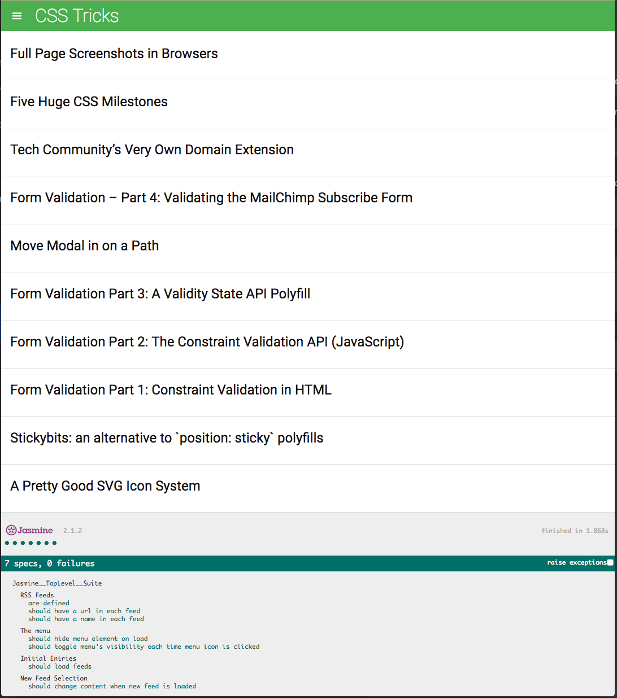

## Neighborhood map project
### Getting started

##### 1. Open your terminal and clone this repository to a directory you like:
```
$ git clone https://github.com/nekki-t/frontend-nanodegree-feedreader.git
```
##### 2. Move to the directory which you cloned to:
```
e.g.
$ cd /{directory}/frontend-nanodegree-feedreader
```
##### 3. Install http-server:
```
$ npm install http-server -g
```
ref. https://github.com/indexzero/http-server
##### 4. Run server:
```
$ http-server
```
##### 5. Visit url:
```
$ http://localhost:8080
```

